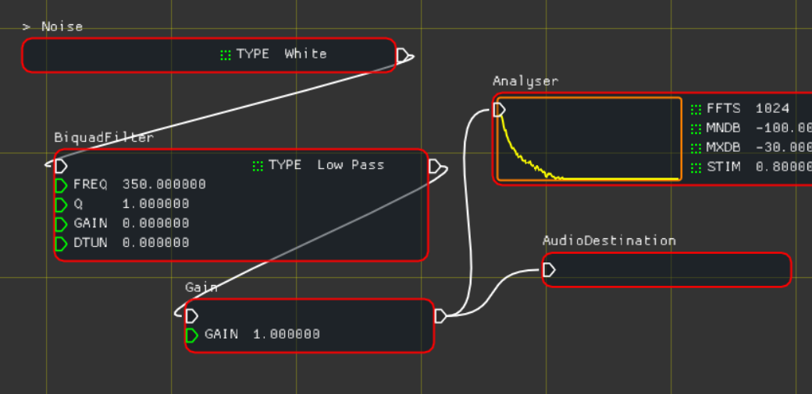

# LabSound GraphToy

Copyright 2020 the LabSound Authors

 Creative Commons, Attribution

The submodules are licensed under their respective terms.

**LabSound GraphToy** is a workspace for exploring **LabSound** nodes and their properties.



Right click on the canvas to create new nodes. Drag wires from outputs to inputs. Click the fields to edit the parameters and settings.

Some nodes, such as the Oscillator must be started before they make sound. These nodes will have a star icon near their name which can be clicked to activate them.

Some nodes, such as the Sfxr node can be signalled for a special behavior. This signal, as in PureData, is a *bang* and is represented near the node's name as an explanation point icon which can be click to emit the bang signal to the node.

## Getting Started

````sh
cd {source-location}
git clone --recursive {this-repo}
cd {build-location}
cmake -G {generator} -DCMAKE_INSTALL_PREFIX={install-location} {source-location}
{run build and install commands}
````

## Credits

**LabSound** [https://github.com/LabSound/LabSound](https://github.com/LabSound/LabSound)

**ImGui** [https://github.com/ocornut/imgui.git](https://github.com/ocornut/imgui.git)

**Sokol** [https://github.com/floooh/sokol.git](https://github.com/floooh/sokol.git)

